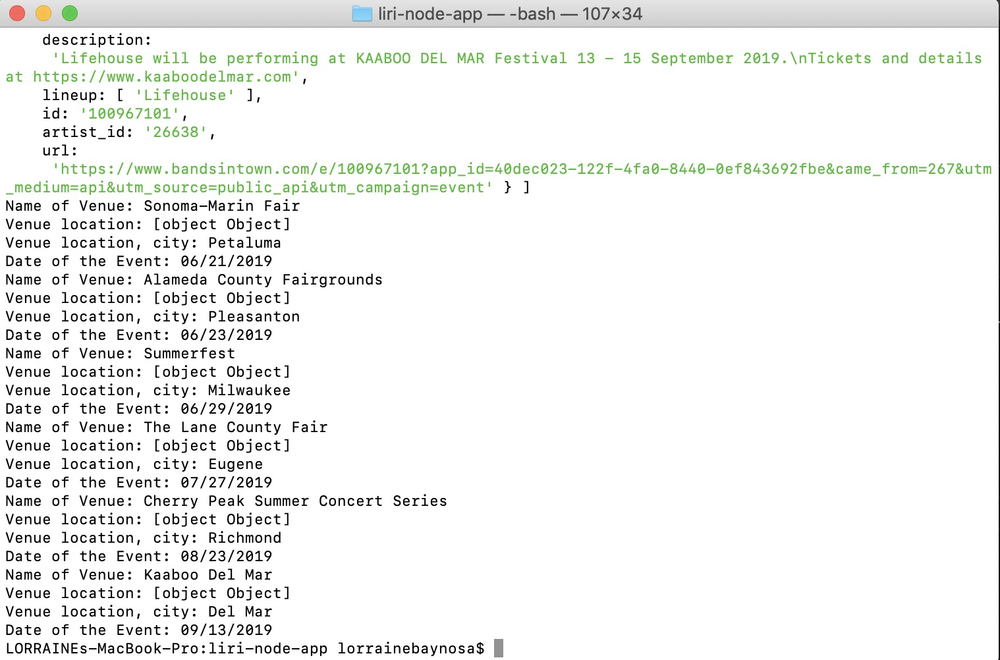
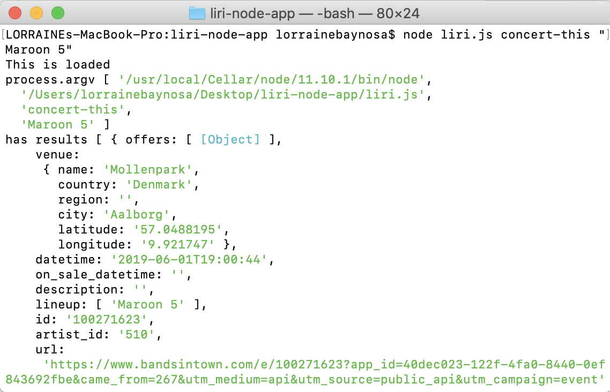

# liri-node-app
LIRI Bot is a Language Interpretation and Recognition Interface instead of the  Speech Interpretation and Recognition Interface used by iPhone's SIRI. LIRI Bot is a Command Line Interface appication, that takes in parameters and returns data. The liri.js file contains the commands that will be accepted by LIRI, namely:
1. "concert-this"
2. "spotify-this-song"
3. "movie-this"
4. "do-what-it-says"

In order to run these commands and utilize the npm packages, the packages must be initiated and installed. See how the package.json file holds required dependencies.package_json

What each command should do: 
1. `node liri.js concert-this <artist/band name here>`
   * searches the Bands in Town Artist Events API (`"https://rest.bandsintown.com/artists/" + artist + "/events?app_id=codingbootcamp"`) for an artist and render the following information about each event to the terminal:
     * Name of the venue
     * Venue location
     * Date of the Event (use moment to format this as "MM/DD/YYYY")
   * Requires installation of [axios] (https://www.npmjs.com/package/axios) package and [moment] (http://momentjs.com/docs) to retrieve event information related to artist.
   * example using command "concert-this" <artist/band name>, using Lifehouse as the band name:

The information for each event for Lifehouse displays on the terminal:

The URICencodeURIComponent function allows us to see the same data for artists with more than one word (testing with Maroon 5): 

The information for each event for Maroon 5 displays on the terminal:

2. `node liri.js spotify-this-song '<song name here>'`
   * renders the following information about the song to the terminal
     * Artist(s)
     * The song's name
     * A preview link of the song from Spotify
     * The album that the song is from
        * If no song is provided then your program will default to "The Sign" by Ace of Base.
   * Requires installation of [node-spotify-api](https://www.npmjs.com/package/node-spotify-api) package to retrieve song information from the Spotify API.
   * example using command "spotify-this-song" '<song name here>' using "Thriller" as the song: 

The information for each song displays on the terminal:

If no song is provided, "The Sign" from Ace of Base:

3. `node liri.js movie-this '<movie name here>'`
   * renders the following information about the movie to the terminal
     * Title of the movie.
     * Year the movie came out.
     * IMDB Rating of the movie.
     * Rotten Tomatoes Rating of the movie.
     * Country where the movie was produced.
     * Language of the movie.
     * Plot of the movie.
     * Actors in the movie.
   * Requires installation of [axios] (https://www.npmjs.com/package/axios) package to retrieve data from the OMDB API. Use `trilogy` as API key for OMDB API.
   * If the user doesn't type a movie in, the program will output data for the movie 'Mr. Nobody.'
        * If you haven't watched "Mr. Nobody," then you should: <http://www.imdb.com/title/tt0485947/>. It's on Netflix!
   * example using command "movie-this" '<movie name here>', using 'Pretty Woman' as the movie:

The information for each movie displays on the terminal:

* If the user doesn't type a movie in, the program will output data for the movie 'Mr. Nobody.'
        * If you haven't watched "Mr. Nobody," then you should: <http://www.imdb.com/title/tt0485947/>. It's on Netflix!
   * example using command "movie-this" '<movie name here>', using 'Mr. Nobody' as the movie:

The information for each movie displays on the terminal:

4. `node liri.js do-what-it-says`
   * Uses `fs` Node package to take text inside of random.txt to call one of LIRI's commands.
     * It should run `spotify-this-song` for "I Want it That Way," as follows the text in `random.txt`:

     * Information for "I Want it That Way," displays to terminal:

     * Edit the text in random.txt to test out the feature for movie-this and concert-this. Testing with: movie-this,"Cinderella" RETURNS:

The information for each movie displays on the terminal:

